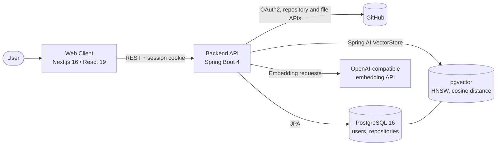
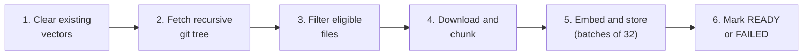

<div align="center">

# CodeMind

**AI-ready knowledge base for your GitHub repositories**

CodeMind connects to GitHub, indexes source code into a vector database, and provides the retrieval foundation for natural-language question answering over your codebases.


</div>

---

## Table of Contents

1. [Overview](#1-overview)
2. [Key Capabilities](#2-key-capabilities)
3. [Project Status](#3-project-status)
4. [System Architecture](#4-system-architecture)
5. [How It Works](#5-how-it-works)
6. [Technology Stack](#6-technology-stack)
7. [Repository Structure](#7-repository-structure)
8. [Getting Started](#8-getting-started)
9. [Configuration Reference](#9-configuration-reference)
10. [API Reference](#10-api-reference)
11. [Data Model](#11-data-model)
12. [Security Considerations](#12-security-considerations)
13. [Known Limitations](#13-known-limitations)
14. [Roadmap](#14-roadmap)
15. [Contributing](#15-contributing)
16. [License](#16-license)

---

## 1. Overview

Understanding an unfamiliar codebase, or returning to one after months, is time-consuming. CodeMind addresses this by turning repositories into a semantically searchable knowledge base.

The platform authenticates users through GitHub, retrieves repository contents, splits source files into chunks, generates vector embeddings for each chunk, and stores them in PostgreSQL using the pgvector extension. Indexed code can then be retrieved by meaning rather than by keyword, which is the core requirement for Retrieval-Augmented Generation (RAG).

The system consists of two applications:

| Application | Directory | Responsibility |
|---|---|---|
| Backend API | `backend/` | GitHub OAuth, repository synchronization, asynchronous indexing pipeline, vector storage |
| Web Client | `client/` | Sign-in, repository management, live indexing progress, workspace overview, settings |

---

## 2. Key Capabilities

| Capability | Description |
|---|---|
| GitHub authentication | OAuth2 sign-in with no separate credentials to manage |
| Repository synchronization | Lists owned, collaborated, and organization repositories, including private ones |
| Background indexing | Non-blocking pipeline that fetches, filters, chunks, embeds, and stores code |
| Real-time progress | Files processed, total files, and chunk count are reported live in the dashboard |
| Intelligent filtering | Excludes dependencies, build artifacts, lock files, hidden files, unsupported types, and oversized files |
| Vector storage | 1536-dimension embeddings with an HNSW index and cosine similarity in pgvector |
| Idempotent re-indexing | Existing vectors for a repository are removed before each run |
| Token protection | GitHub access tokens are encrypted at rest |
| Modern interface | Responsive dashboard with search, status filters, and light/dark themes |

---

## 3. Project Status

| Area | Status |
|---|---|
| GitHub OAuth login and session management | Complete |
| Repository synchronization and listing | Complete |
| Asynchronous indexing pipeline | Complete |
| Indexing status API and live progress UI | Complete |
| Dashboard (repositories, overview, settings) | Complete |
| RAG question answering over indexed code | Compete |

The retrieval layer is in place. The conversational query endpoint and chat interface are the next milestone (see [Roadmap](#14-roadmap)).

---

## 4. System Architecture



Relational data and vector data share a single PostgreSQL instance (`pgvector/pgvector:pg16`). This keeps operations simple: one database to provision, back up, and monitor.

---

## 5. How It Works

### 5.1 Authentication

1. The user selects **Sign in with GitHub**. The browser is redirected to `/oauth2/authorization/github` on the backend.
2. The backend runs the OAuth2 flow with the scopes `read:user` and `repo`.
3. On success, the backend creates or updates the user record, encrypts the GitHub access token, and issues an HTTP-only `CODEMIND_SESSION` cookie.
4. The user is redirected to the client's `/auth/callback` route, which loads the profile from `GET /api/auth/me` and forwards to `/dashboard`.
5. Client middleware checks for the session cookie on every navigation and redirects unauthenticated visitors to `/login`.

### 5.2 Repository Synchronization

`GET /api/repos` retrieves repositories from the GitHub API (up to 10 pages of 100) and upserts them by `(user_id, github_repo_id)`. The dashboard loads the cached list first and syncs from GitHub only when the list is empty or when the user requests a refresh.

### 5.3 Indexing Pipeline

`POST /api/repos/{id}/index` marks the repository as `INDEXING`, returns `202 Accepted`, and delegates the work to a dedicated thread pool (core size 2, max size 4, queue capacity 50).



| Stage | Behavior |
|---|---|
| Clear | Deletes vectors whose `repoId` metadata matches the repository |
| Fetch tree | Retrieves the default branch's full file tree in a single GitHub API call |
| Filter | Applies `CodeFileFilter` (rules below) |
| Chunk | Prefixes each file with a `// File: <path>` header and splits it with Spring AI's `TokenTextSplitter` (approximately 200 tokens per chunk) |
| Embed and store | Writes chunks to pgvector in batches of 32; each chunk carries `repoId`, `filePath`, `language`, and `chunkIndex` metadata |
| Progress | Updates `filesProcessed`, `filesTotal`, and `chunkCount` every 5 files |
| Completion | Sets `READY` with `indexedAt`, or `FAILED` with an error message (truncated to 2,000 characters) |

**File eligibility rules**

- Excluded directories: `node_modules`, `.git`, `dist`, `build`, `target`, `.next`, `vendor`, `coverage`, `out`, `.idea`, `.vscode`
- Excluded files: lock files (`package-lock.json`, `yarn.lock`, `pnpm-lock.yaml`, and similar), hidden files, and files larger than 100 KB
- Included types: common source, configuration, and documentation formats, including Java, Kotlin, TypeScript/JavaScript, Python, Go, Rust, C/C++, C#, Swift, SQL, shell, HTML/CSS, Markdown, YAML/JSON/TOML/XML, Vue, Svelte, Dockerfile, and Makefile

**Resilience.** A failure on an individual file is logged and skipped so a single problem does not abort the run. A configurable delay (default 50 ms) between GitHub requests reduces the risk of hitting rate limits.

**Progress reporting.** While any repository is `INDEXING`, the client polls the repository list every 2 seconds and the status endpoint every 1.5 seconds.

### 5.4 Retrieval Foundation

Every chunk is stored with its embedding and a `repoId` tag, so similarity search can be scoped to a single repository. Retrieval settings live in `RagSettings`, and the client contains the query keys and message components needed for the chat experience, which is planned next.

---

## 6. Technology Stack

**Backend**

- Java 21, Spring Boot 4.1, Maven Wrapper
- Spring Security with OAuth2 Client
- Spring Data JPA (Hibernate), PostgreSQL 16
- Spring AI 2.0: OpenAI-compatible chat and embedding models, `TokenTextSplitter`, pgvector `VectorStore`
- Lombok

**Frontend**

- Next.js 16 (App Router, middleware route protection), React 19, TypeScript 5
- Tailwind CSS 4, shadcn/ui, Base UI, Lucide and Hugeicons
- TanStack Query for server state and polling, Zustand for auth state
- next-themes, Recharts

**Infrastructure**

- Docker Compose with the `pgvector/pgvector:pg16` image

---

## 7. Repository Structure

```
CodeMind/
├── backend/                            Spring Boot API
│   └── src/main/java/com/codeMind/backend/
│       ├── config/                     Security, CORS, encryption, async executor
│       ├── controller/                 AuthController, RepoController
│       ├── dto/                        Response objects
│       ├── entity/                     User, GitHubRepository
│       ├── enums/                      IndexStatus
│       ├── exceptions/                 Custom exceptions and global handler
│       ├── repository/                 Spring Data repositories
│       ├── security/                   OAuth2 user service, principal, handlers
│       └── services/
│           ├── ai/                     RAG settings
│           ├── github/                 GitHub API client, rate limiter
│           ├── indexing/               CodeFileFilter, CodeChunker
│           └── implementation/         Service implementations
├── client/                             Next.js web client
│   ├── app/                            Routes: /login, /auth/callback, /dashboard/*
│   ├── components/                     UI primitives, dashboard, layout, providers
│   ├── hooks/                          use-auth, use-repo
│   ├── lib/                            API client, query keys, navigation
│   ├── store/                          Zustand auth store
│   └── middleware.ts                   Session-based route protection
├── docker/postgres/                    Database initialization scripts
├── docker-compose.yml                  PostgreSQL with pgvector
└── LICENSE
```

---

## 8. Getting Started

### 8.1 Prerequisites

| Requirement | Notes |
|---|---|
| JDK 21 | Required to build and run the backend |
| Node.js 20+ and npm | Required for the client |
| Docker and Docker Compose | Runs PostgreSQL with pgvector |
| GitHub OAuth App | [Create one](https://github.com/settings/developers). Homepage URL: `http://localhost:3000`. Callback URL: `http://localhost:8080/login/oauth2/code/github` |
| OpenAI-compatible API key | Endpoint must serve `text-embedding-3-small` and a chat model |

### 8.2 Installation

**1. Clone the repository**

```bash
git clone https://github.com/soumyadip-adak99/CodeMind.git
cd CodeMind
```

**2. Start the database**

```bash
docker compose up -d
```

PostgreSQL 16 with pgvector starts on port `5432` (database `codemind`, user and password `postgres`).

**3. Configure and start the backend**

```bash
cd backend

export GITHUB_CLIENT_ID=<client-id>
export GITHUB_CLIENT_SECRET=<client-secret>
export NVDIA_OPEN_AI_API_KEY=<api-key>
export OPEN_AI_BASE_URL=<https://your-endpoint/v1>
export ENCRYPTION_PASSWORD=<long-random-password>
export SALT_VALUE=<hex-salt>            # for example: openssl rand -hex 16
export FRONTEND_URL=http://localhost:3000
export CORS_ALLOWED_ORIGINS=http://localhost:3000

./mvnw spring-boot:run
```

On Windows, use `mvnw.cmd` and define the variables with `set` (CMD) or `$env:` (PowerShell). The API listens on `http://localhost:8080`.

**4. Start the client**

```bash
cd client
npm install
echo "NEXT_PUBLIC_API_BASE_URL=http://localhost:8080" > .env.local
npm run dev
```

Open `http://localhost:3000`, sign in with GitHub, and start indexing a repository.

### 8.3 Verifying the Setup

| Check | Expected result |
|---|---|
| `docker compose ps` | `codemind-postgres` is healthy |
| `GET http://localhost:8080/api/auth/login-url` | `{"url":"/oauth2/authorization/github"}` |
| Sign in, then open Repositories | Your GitHub repositories are listed |
| Start indexing on a small repository | Status moves `INDEXING` to `READY` and chunk count is greater than zero |

---

## 9. Configuration Reference

### 9.1 Backend Environment Variables

| Variable | Required | Description |
|---|---|---|
| `GITHUB_CLIENT_ID` | Yes | GitHub OAuth App client ID |
| `GITHUB_CLIENT_SECRET` | Yes | GitHub OAuth App client secret |
| `NVDIA_OPEN_AI_API_KEY` | Yes | API key for the OpenAI-compatible provider (spelled as in `application.yaml`) |
| `OPEN_AI_BASE_URL` | Yes | Base URL of the OpenAI-compatible API |
| `ENCRYPTION_PASSWORD` | Yes | Password used to encrypt stored GitHub tokens |
| `SALT_VALUE` | Yes | Hex-encoded salt for token encryption |
| `FRONTEND_URL` | Yes | Client URL used for post-login redirects |
| `CORS_ALLOWED_ORIGINS` | Yes | Comma-separated list of allowed origins |
| `DB_URL` | No | JDBC URL. Default: `jdbc:postgresql://localhost:5432/codemind` |
| `DB_USERNAME` | No | Database user. Default: `postgres` |
| `DB_PASSWORD` | No | Database password. Default: `postgres` |

### 9.2 Client Environment Variables

| Variable | Default | Description |
|---|---|---|
| `NEXT_PUBLIC_API_BASE_URL` | `http://localhost:8080` | Backend base URL |

### 9.3 Application Properties

| Property | Default | Description |
|---|---|---|
| `app.indexing.max-file-bytes` | `102400` | Files larger than this are skipped |
| `app.indexing.chunk-size` | `800` | Target chunk size; converted to approximately `size / 4` tokens |
| `app.github.api-delay-ms` | `50` | Delay between GitHub file requests |
| `spring.ai.openai.chat.model` | `openai/gpt-oss-20b` | Chat model |
| `spring.ai.openai.embedding.model` | `text-embedding-3-small` | Embedding model |
| `spring.ai.vectorstore.pgvector.dimensions` | `1536` | Embedding dimensions |
| `spring.ai.vectorstore.pgvector.index-type` | `HNSW` | Vector index type |
| `spring.ai.vectorstore.pgvector.distance-type` | `COSINE_DISTANCE` | Similarity metric |
| `server.servlet.session.timeout` | `7d` | Session lifetime |

---

## 10. API Reference

All `/api/**` endpoints require an authenticated session unless marked public. Errors use a consistent format:

```json
{
  "status": 404,
  "error": "Not Found",
  "message": "Repository not found",
  "timestamp": "2026-01-01T00:00:00Z"
}
```

### Authentication

| Method | Endpoint | Access | Description |
|---|---|---|---|
| `GET` | `/oauth2/authorization/github` | Public | Starts the GitHub OAuth flow |
| `GET` | `/api/auth/login-url` | Public | Returns the OAuth start path |
| `GET` | `/api/auth/me` | Authenticated | Returns the current user's profile |
| `POST` | `/api/auth/logout` | Public | Invalidates the session and clears cookies |

### Repositories

| Method | Endpoint | Description |
|---|---|---|
| `GET` | `/api/repos?refresh=true` | Lists repositories. `refresh=true` (default) syncs from GitHub first; `false` returns the cached list |
| `GET` | `/api/repos/{id}` | Returns a single repository |
| `POST` | `/api/repos/{id}/index` | Starts background indexing. Returns `202`, or `400` if already running |
| `GET` | `/api/repos/{id}/status` | Returns indexing progress |

**Example: status response**

```json
{
  "repositoryId": "3f1c2a9e-8d34-4c1b-9a0e-5b6f7d8e9a10",
  "indexStatus": "INDEXING",
  "filesTotal": 128,
  "filesProcessed": 45,
  "chunkCount": 312,
  "indexedAt": null,
  "errorMessage": null
}
```

---

## 11. Data Model

### `users`

| Column | Type | Notes |
|---|---|---|
| `id` | UUID | Primary key |
| `github_id` | BIGINT | Unique |
| `github_username`, `display_name`, `avatar_url` | text | Profile data |
| `access_token` | TEXT | Encrypted GitHub token |
| `token_scopes` | text | Granted OAuth scopes |
| `created_at` | timestamp | |

### `github_repository`

Unique constraint on `(user_id, github_repo_id)`.

| Column | Type | Notes |
|---|---|---|
| `id` | UUID | Primary key; also used as `repoId` in vector metadata |
| `user_id`, `github_repo_id` | UUID, BIGINT | Ownership and GitHub identity |
| `owner`, `name`, `full_name`, `default_branch`, `language`, `html_url`, `description` | text | Repository details |
| `is_private` | boolean | |
| `index_status` | enum | `PENDING`, `INDEXING`, `READY`, `FAILED` |
| `files_count`, `files_processed`, `chunk_count` | integer | Indexing progress |
| `indexed_at`, `error_message`, `created_at`, `update_at` | mixed | Lifecycle data |

### Vector store

Managed by Spring AI. Each record holds the chunk text, its 1536-dimension embedding, and JSON metadata (`repoId`, `filePath`, `language`, `chunkIndex`).

The schema is currently generated by Hibernate (`ddl-auto: update`) and Spring AI (`initialize-schema: true`).

---

## 12. Security Considerations

| Area | Implementation |
|---|---|
| Authentication | GitHub OAuth2 only; passwords are never handled by CodeMind |
| Token storage | GitHub access tokens are AES-encrypted before persistence and decrypted only to call GitHub on the user's behalf |
| Session | `CODEMIND_SESSION` cookie is `HttpOnly` and `SameSite=Lax`, with a 7-day timeout |
| Authorization | All repository operations are scoped to the authenticated user, preventing cross-user access |
| Route protection | Unauthenticated API calls return `401`; client middleware redirects unauthenticated page loads |
| OAuth scope | The `repo` scope is required to read private repositories; users should be aware of the access it grants |

---

## 13. Known Limitations

- RAG question answering is not yet available; only indexing and storage are implemented.
- The `chunk-overlap` property is defined in configuration but not yet applied by the chunker.
- Database schema is managed by Hibernate auto-update; versioned migrations are not enabled.
- Re-indexing rebuilds the full repository rather than only changed files.
- Automated test coverage is minimal.

---

## 14. Roadmap

- [ ] RAG chat endpoint with top-K retrieval and streamed (SSE) responses
- [ ] Chat interface with per-repository sessions and history
- [ ] Source citations linking answers to files and lines
- [ ] Incremental re-indexing of changed files only
- [ ] Syntax-aware chunking at function and class boundaries
- [ ] Flyway database migrations
- [ ] Automated tests and CI pipeline
- [ ] Production Dockerfiles for backend and client

---

## 15. Contributing

Contributions are welcome.

1. Fork the repository.
2. Create a feature branch: `git checkout -b feature/your-feature`
3. Commit with a clear message: `git commit -m "Add your feature"`
4. Push the branch: `git push origin feature/your-feature`
5. Open a pull request describing the change and its motivation.

---

## 16. License

Released under the [MIT License](LICENSE). Copyright (c) 2026 Soumyadip Adak.